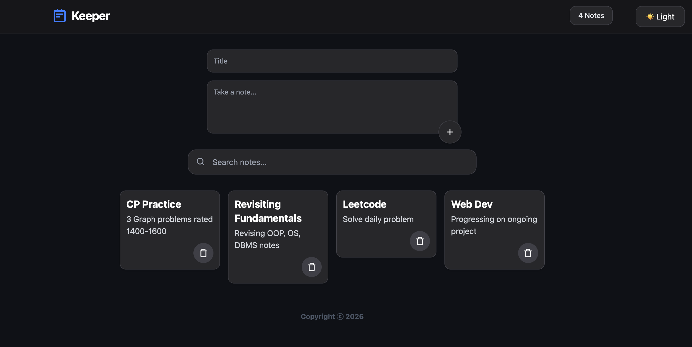

# NoteSphere

A modern and minimal note-taking application built with React and Tailwind CSS.  
NoteSphere provides a clean productivity-focused experience with real-time search, dark/light themes, responsive design, and persistent local storage support.



---
## Live Demo

[Visit NoteSphere](https://notesphere-ashen.vercel.app)

## Features

- 🌙 **Dark / Light Theme**
  - Smooth theme switching with a modern UI.

- 🔎 **Real-Time Search**
  - Instantly filter notes by title or content.

- 📝 **Create & Delete Notes**
  - Simple and intuitive note management.

- 📊 **Dynamic Notes Counter**
  - Live counter updates automatically as notes are added or removed.

- 💾 **Local Storage Persistence**
  - Notes remain saved even after refreshing or reopening the browser.

- ⚠️ **Input Validation**
  - Prevents empty notes from being created.

- 📱 **Responsive Design**
  - Optimized for desktop, tablet, and mobile devices.

- ✨ **Modern UI/UX**
  - Clean layouts, smooth transitions, hover interactions, and polished styling.

---

## Tech Stack

- **React JS** — Frontend library for building interactive UIs.
- **Tailwind CSS** — Utility-first CSS framework for modern styling.
- **Vite** — Fast frontend build tool and development server.
- **Boxicons** — Icon library for UI elements.

---

## Installation

Clone the repository:

```bash
git clone https://github.com/tripathiaman0709/notesphere.git